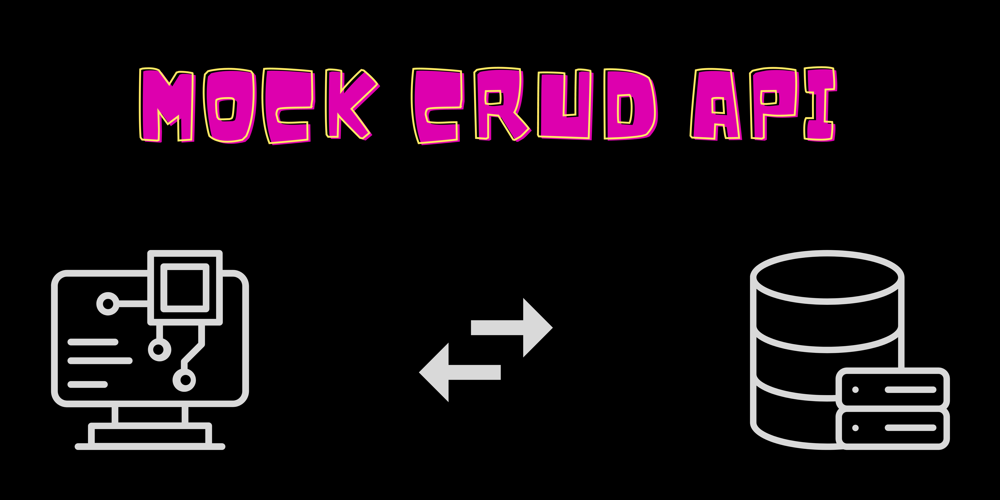

# mock-crud-api

This package allows you to create mock REST API servers for testing and development purposes. It provides a simple and convenient way to define server configurations, handle requests, and send mock responses.



[](https://github.com/itsvinayak/mock-crud-api/actions/workflows/lint-and-uts.yml)


## Features

- Define server configurations with port, path, request type, input, output, and error handling options.
- Handle HTTP requests.
- Compare request input with predefined input to determine the response.
- Customize response outputs and error codes.
- Parse query strings and extract parameters.
- Validate and ensure required data fields are present.
- Start multiple servers simultaneously using a configuration file.
- Display helpful information and syntax examples.

## Installation

To install the mock-crud-api package, follow these steps:

- Make sure you have Node.js installed on your machine.
- Open a terminal or command prompt.
- Navigate to your project directory.
- Run the following command to install the package:

```bash
npx mock-crud-api -config config.json
```

```bash
npx mock-crud-api -c config.json
```

## Usage

To use the mock-crud-api package, follow these steps:

- Create a configuration file (e.g., config.json) with the server configurations.

```JSON
[
    {
        "name": "post-server",
        "method": "POST",
        "port": 3000,
        "path": "/",
        "input": {
            "method": "text"
        },
        "code": 200,
        "output": "text",
        "errorCode": 500,
        "errorMessage": "Internal Server Error"
    },
    {
        "name": "get-server-1",
        "method": "GET",
        "port": 3001,
        "path": "/test",
        "input": null,
        "code": 200,
        "output": "text"
    },
    {
        "name": "get-server-2",
        "method": ["GET"],
        "port": 3002,
        "path": "/test",
        "input": {},
        "code": 201,
        "output": "text"
    },
    {
        "name": "patch-server-3",
        "method": ["PATCH", "PUT"],
        "port": 3003,
        "path": "/test",
        "input": {
            "method": "json"
        },
        "code": 201,
        "output": "Updated",
        "errorCode": 500,
        "errorMessage": "Internal Server Error"
    }
]
```

In the configuration file, you can define multiple server configurations. Each configuration object should have the following properties:

- name: The name of the server.
- type: The HTTP request method (e.g., GET, POST, PUT, DELETE).
- port: The port number on which the server will listen.
- path: The API endpoint path for the server.
- input: The input for which the output is to be generated.
- code: Code if server found successfully
- output: The output to be generated for matching requests.
- errorCode: The error code to be returned if the server is not found.
- errorMessage: The error message to be returned if the server is not found.

### License 
This package is released under the MIT License.
